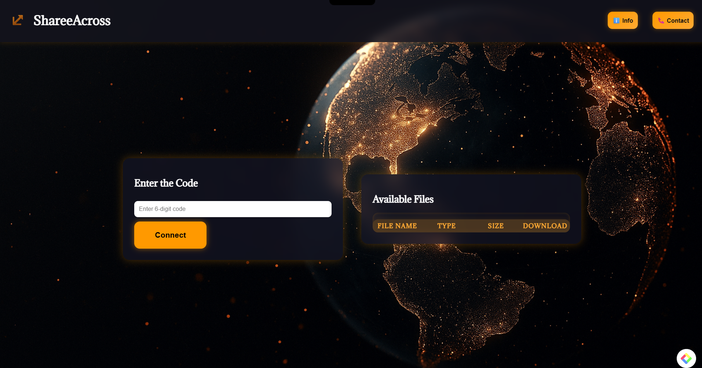

# 🚀 ShareeAcross

**ShareeAcross** is a seamless file-sharing web application that allows users to **send and receive files between devices** using simple codes, QR links, or direct upload/download. Built with a clean interface and real-time file exchange logic, it's designed for **speed**, **ease of use**, and **cross-device compatibility**.

---

## 🌟 Features

- 🔐 **Send/Receive Files** with secure and unique codes
- 📤 Upload any file and generate a download link
- 📱 Compatible with **mobile**, **tablet**, and **desktop**
- 📎 Drag & Drop file upload interface
- 📥 Receive files directly by entering a code or scanning QR
- 🧾 File list table with clear details
- ✨ Clean UI with responsive design

---

## 🖼️ Interface Preview

> Explore the look and flow of ShareeAcross 👇

  
  
  
  
  
  
  

---

## 🛠️ Tech Stack

- **Frontend:** HTML, CSS, JavaScript
- **Backend:** Node.js, Express
- **File Handling:** Multer
- **UI Styling:** Custom CSS (mobile responsive)
- **QR Code:** Integrated for fast receive
- **Hosting:** Render (or any fast web server)

---

## 📦 How It Works

### 🔼 Sending Files
1. Click on **Upload/Share** section.
2. Select your file.
3. Get the **code or QR** to share.
4. Share the code with the receiver.

### 🔽 Receiving Files
1. Go to **Receive/Download** section.
2. Enter the code or scan the QR.
3. Download your file directly.

---

## 🎯 Use Cases

- Sending files between phone and laptop 💻📱
- Quick transfer in classrooms, offices, events 🔁
- No sign-in, no cloud syncing – **just fast and direct** ⚡

---

## 📸 Screenshot Summary

| Screen | Description |
|--------|-------------|
|  | Homepage interface |
|  | Info page |
|  | contact page |
|  | Send Files page |
|  | Receive files page |
|  | Send files page after uploading files |
|  | Receive files page after uploading files |

---

## 🚀 Future Enhancements

- 🔄 Add history of sent/received files
- 🔐 Expiry timers for links
- 📊 Download stats
- 🧩 PWA support for offline access

---

